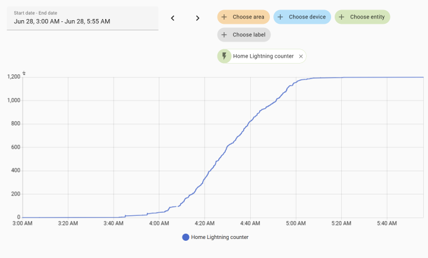
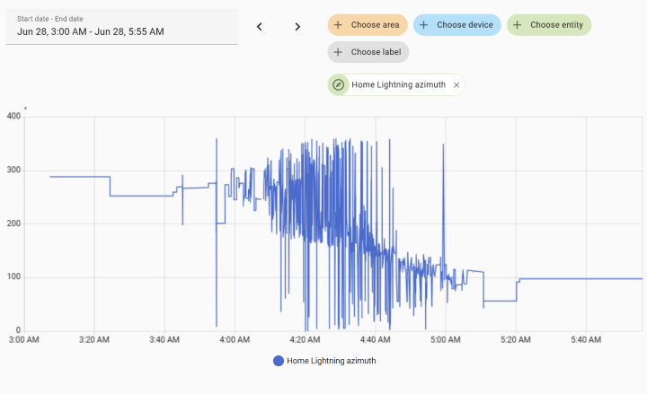
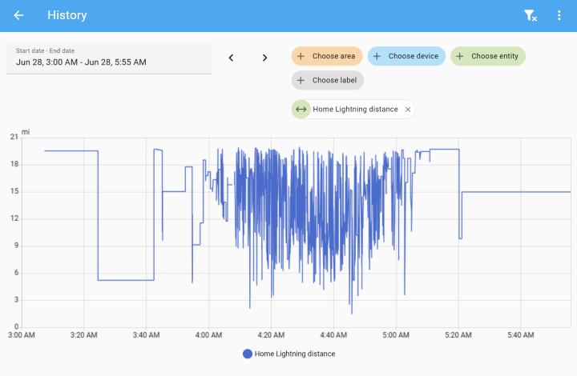
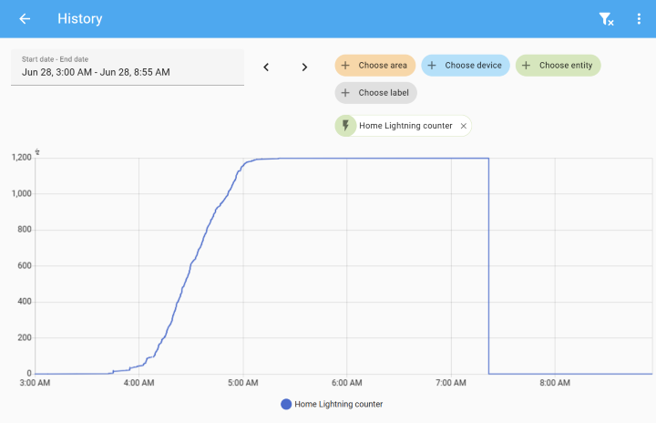

# Blitzortung.org lightning detector

Blitzortung.org is a worldwide, real time, community collaborative lightning location network. This component uses Blitzortung data and provides real time notifications about lightning strikes in given area (by default within 100km radius of your home). Data is served through a public MQTT server (dedicated to serve requests for this component) - thanks to geohash-based topics and some other optimizations it greatly reduces amount of data sent to clients comparing to direct websocket connection to Blitzortung servers (it is also required by Blitzortung data usage policy - third party apps must use their own servers to server data for their own clients).

# Features
- distance and azimuth sensors of lightning strikes nearby
- counter of lightning strikes
- emits geo_location events for lightning strikes (visible on the map)
- data is realtime, with average delay of few seconds

# Manual installation
Place `custom_components/blitzortung` directory inside custom_components dir and restart Home Assistant

# HACS installation
This component is available on HACS default

# Configuration
Search for Blitzortung on `Configuration/Integrations` page. After adding integration, you can optionally configure the location and radius with Blitzortung/Options (by default your home locattion is used with 100km radius).

You can change the coordinates for an existing Blitzortung configuration using the reconfigure flow, go to **Settings** >> **Devices & services** >> **Blitortung** >> **3 dot menu** >> **Reconfigure**.

To change the detection radius, time window, and max tracked lightnings, go to **Settings** >> **Devices & services** >> **Blitortung** >> **Configure**.

# Reviews and How-Tos
You can read and see (youtube) how this component was used in the following community video.
[How to Add a Lightning Sensor](https://www.vcloudinfo.com/2020/08/adding-a-lightning-sensor-to-home-assistant.html)

# Example

This storm event occurred on 28 June 2025 at Nisswa, MN, USA [-94.272, 46.516].

Blitzortung was configured:

* Lightning detection radius: 20 mi
* Time window: 120
* Max number of tracked lightnings: 100

## Results

### Lightning strike count

### Lightning strike azimuth

### Lightning strike distance

### Effect of time window

Zooming out a bit on the lightning strike count, you can see the effect of the 120 minute time window.

